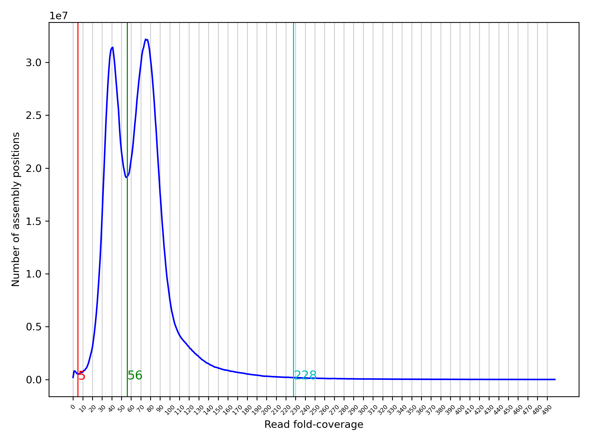

# Primary Assembly

Hic_file1="full path hi-c file 1"
Hic_file2="full path hi-c file 2"
HiFi_file="full path HiFi reads file"
Genome_prefix="specify genopme prefix"
purge_dups_path="full path to purge_dups bin folder"
```bash
hifiasm -o $Genome_prefix -t32 --h1 $Hic_file1 --h2 $Hic_file2 $HiFi_file -s 0.35 --primary > hifi_assembly_hic_primary.log 2>&1 &
```

## Quality Control

```bash
busco -i $Genome_prefix.hic.p.fasta -o busco_camelea -l metazoa -c 8 -m geno -f ##change the parameters based on the organism of interest
```

## Running Purge_Dups:

### Map HiFi Reads to Assembly and Assembly to itself

```bash
minimap2 -x map-hifi -t 28 $Genome_prefix.hic.p.fasta $HiFi_file > $Genome_prefix.Hifi.paf

$purge_dups_path/split_fa $Genome_prefix.hic.p.fasta > split.fasta

minimap2 -I 200G -t 24 -xasm5 -DP split.fasta split.fasta > split.genome.paf
```

### Calculate Haploid/Diploid Coverage Threshold and Remove Haplotype Duplicates from Assembly

```bash
$purge_dups_path/pbcstat $Genome_prefix.Hifi.paf

$purge_dups_path/calcuts PB.stat > cutoffs 2>calcults.log

$purge_dups_path/purge_dups -2 -T cutoffs -c PB.base.cov split.genome.paf > dups.bed 2> purge_dups.log

$purge_dups_path/get_seqs dups.bed $Genome_prefix.hic.p.fasta
```

### Calculate Haploid/Diploid Coverage Threshold and Remove Haplotype Duplicates from Assembly

```bash
$purge_dups_path/pbcstat Chamelea_Hifi.paf

$purge_dups_path/calcuts PB.stat > cutoffs 2>calcults.log

$purge_dups_path/purge_dups -2 -T cutoffs -c PB.base.cov split.genome.paf > dups.bed 2> purge_dups.log

$purge_dups_path/get_seqs -p $Genome_prefix.purged dups.bed $Genome_prefix.hic.p.fasta
```
#### Suggestion at this point you can use hist_plot.py scripts of purge_dups package to produce a genome coverage plot and set the best cutoff values

```bash
python3 hist_plot.py -c cutoffs PB.stat PB.cov.png
```

<p align="center">

</p>
